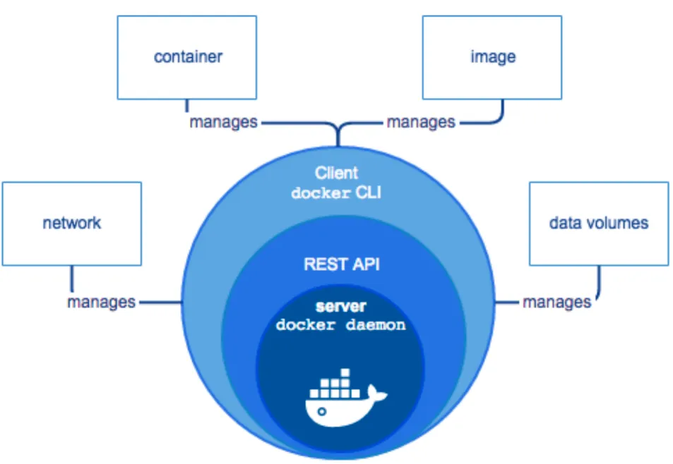
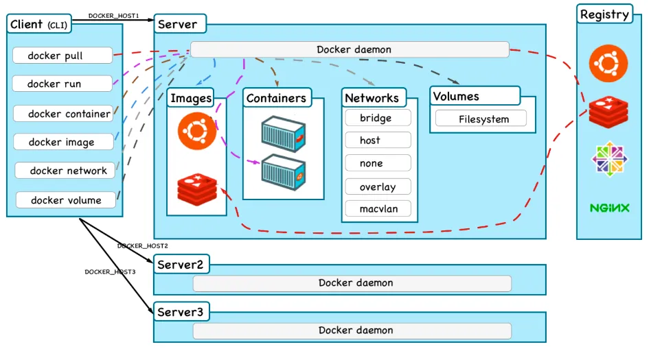

## Docker介绍

[Docker官网地址](https://www.docker.com/)

- Docker是一款用Go语言开发的，用于开发、运行和部署应用程序的开放管理平台；它提供了一个在完全隔离环境中运行和打包应用程序的能力，通常将这个隔离的环境成为容器；
- Docker已经提供工具和组件(Docker Client、Docker Daemon等)来管理容器的生命周期：
   - 由于容器是隔离的环境，所以其具有隔离性和安全性；
   - 可以在一个宿主机上同时运行多个容器，且不会相互干扰；

## Docker 主要解决的问题

- 保证程序运行环境的一致性；
- 降低配置开发环境、生产环境的复杂度和成本；
- 实现程序的快速部署和分发。

## Docker和虚拟机的区别

## Docker架构 (C/S)

Docker是一种C/S架构的产品（Docker Engine）

### Docker引擎（Docker Engine）

- Server端：本质上一个守护进程（docker daemon）,主要的职责是负责创建并管理Docker的对象（镜像、容器、网络、数据卷）
- REST API: 一套用于与和Docker Daemon通信的接口协议
- Client端：本质是一个命令行接口（Command Line Interface）,主要的职责是接收用户在命令行的指令，通过协议（REST API）直接操作Docker Daemon执行用户操作。

### 结构图

- Docker客户端(Docker Client)
   - Docker客户端(Docker Client)是用户与Docker进行交互的最主要方式。当在终端输入docker命令时，对应的就会在服务端产生对应的作用，并把结果返回给客户端。Docker Client除了连接本地服务端，通过更改或指定DOCKER_HOST连接远程服务端。
- Docker服务端(Docker Server)
   - Docker Daemon其实就是Docker 的服务端。它负责监听Docker API请求(如Docker Client)并管理Docker对象(Docker Objects)，如镜像、容器、网络、数据卷等
- Docker Registries
   - 俗称Docker仓库，专门用于存储镜像的云服务环境.
   - Docker Hub就是一个公有的存放镜像的地方，类似Github存储代码文件。同样的也可以类似Github那样搭建私有的仓库。
- Docker 对象(Docker Objects)
   - Image（镜像）：一个Docker的可执行文件，其中包括运行应用程序所需的所有代码内容、依赖库、环境变量和配置文件等。
   - Container（容器）：镜像被运行起来后的实例。
   - Network（网络）：外部或者容器间如何互相访问的网络方式，如host模式、bridge模式。
   - Volume（数据卷）：容器与宿主机之间、容器与容器之间共享存储方式，类似虚拟机与主机之间的共享文件目录。

## Docker 底层技术实现

- Docker使用Go语言实现。
- Docker利用linux内核的几个特性来实现功能:
   - 利用linux的命名空间(Namespaces)
   - 利用linux控制组(Control Groups)
   - 利用linux的联合文件系统(Union File Systems)
- Docker只能在linux上运行，在windows、MacOS上运行Docker，其实本质上是借助了虚拟化技术，然后在linux虚拟机上运行的Docker程序
- 容器格式（ Container Format ）:
   - Docker Engine将namespace、cgroups、UnionFS进行组合后的一个package，就是一个容器格式(Container Format)。Docker通过对这个package中的namespace、cgroups、UnionFS进行管理控制实现容器的创建和生命周期管理。
   - 容器格式(Container Format)有多种，其中Docker目前使用的容器格式被称为libcontainer
- Namespaces（命名空间）：为Docker容器提供操作系统层面的隔离
   - 进程号隔离：每一个容器内运行的第一个进程，进程号总是从1开始起算
   - 网络隔离：容器的网络与宿主机或其他容器的网络是隔离的、分开的，也就是相当于两个网络
   - 进程间通隔离：容器中的进程与宿主机或其他容器中的进程是互相不可见的，通信需要借助网络
   - 文件系统挂载隔离: 容器拥有自己单独的工作目录
   - 内核以及系统版本号隔离：容器查看内核版本号或者系统版本号时，查看的是容器的，而非宿主机的
- Control Groups（控制组-cgroups）：为Docker容器提供硬件层面的隔离
   - 控制组能控制应用程序所使用的硬件资源。
   - 基于该特性，控制组帮助docker引擎将硬件资源共享给容器使用，并且加以约束和限制。如控制容器所使用的内存大小。
- Union File Systems（联合文件系统--UnionFS）：利用分层(layer)思想管理镜像和容器
